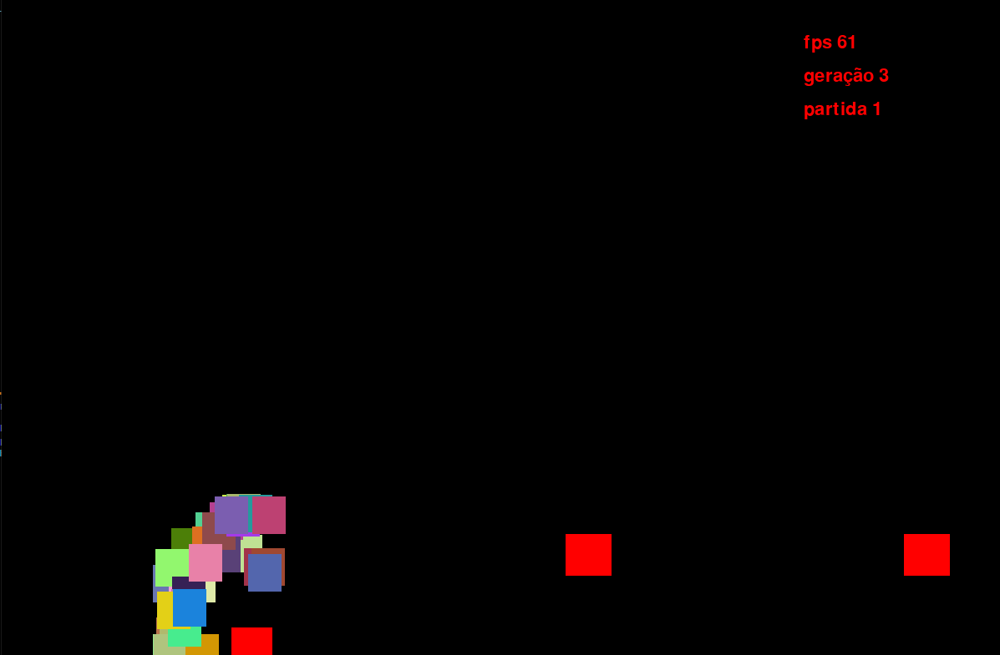

# Jogo do Dino do Google - Rede Neural

Este é um projeto que utiliza redes neurais para controlar um agente virtual em uma versão do jogo "T-Rex Game" do Google Chrome. A rede neural é treinada para permitir que o dino evite obstáculos que surgem no caminho.

## Descrição do Projeto
O objetivo deste projeto é explorar o uso de redes neurais para criar um agente inteligente capaz de jogar o Jogo do Dino de forma autônoma. Utilizando a biblioteca Pytorch, numpy, e outras. Desenvolvi uma versão simplificada do jogo em que o dino deve pular ou agachar para evitar os cactos que aparecem em sua frente.

## Arquitetura da Rede Neural
A arquitetura da rede neural pode ser personalizada de várias maneiras para experimentar diferentes configurações e otimizar o desempenho do jogador:

- Camadas e Neurônios: Ajuste o número de camadas e neurônios em cada camada para explorar diferentes configurações.
- Indivíduos: Especifique a quantidade de indivíduos para entender como diferentes tamanhos de populações afetam o aprendizado.
- Partidas por Geração: Cada indivíduo pode jogar múltiplas partidas, reduzindo o impacto do acaso e fornecendo resultados mais confiáveis.
- Camada de Entrada: Escolha as entradas que você julga necessárias na camada de entrada para ajustar a complexidade da adaptação da rede neural.
- Elitismo: Defina quantas cópias do melhor indivíduo serão feitas, com leves mutações, visando possíveis variações vantajosas.
- Recompensa Objetivo: Influencie a taxa de mutação dos indivíduos com base na proximidade do desempenho em relação ao objetivo.

## Funcionamento do Algoritmo
Para otimizar o desempenho da rede neural, foi empregado um algoritmo genético, junto com estratégias evolutivas. A cada geração, são selecionados aleatoriamente dois indivíduos (com maior probabilidade para os melhores desempenhos) para gerar um novo indivíduo com características semelhantes aos "pais". Essa seleção é repetida até que a nova população esteja completa. Além disso, uma pequena chance de mutação é introduzida durante a criação do novo indivíduo para aumentar a diversidade genética e a possibilidade de melhor desempenho.

## Como Executar

- Pré-requisitos:
  - Certifique-se de ter o Python instalado em seu computador. Você pode baixá-lo em python.org.
  - Instale as bibliotecas executando "pip install -r requirements.txt" em seu terminal ou prompt de comando.
    
- Baixando o repositório:
  - Clone este repositório com o comando "git clone https://github.com/Vitor-Moura48/Rede_Neural_Dino.git".
    
- Executando o projeto:
  - Abra o terminal ou prompt de comando e navegue até o diretório onde você extraiu/clonou o jogo.
  - Execute o arquivo principal do projeto digitando python main.py no seu terminal, ou simplesmente execute na sua IDE preferida.

## Contribuições
Este projeto está em constante evolução, e qualquer sugestão ou melhoria é bem-vinda. Se você tem ideias para aprimorar o jogo ou o algoritmo, sinta-se à vontade para compartilhar suas recomendações.

